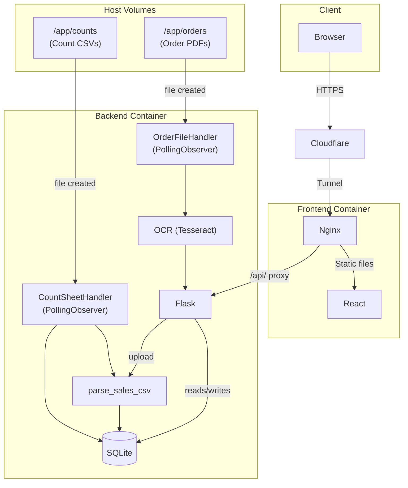
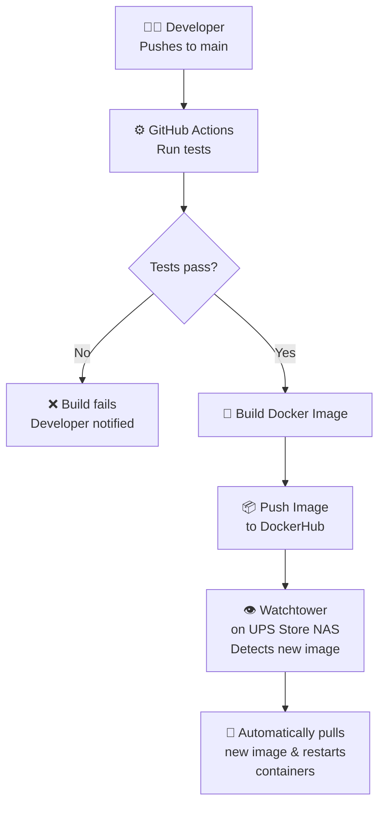

# CSCI4970-PackagingProfessionals
An inventory management software for The UPS Store #4166 meant to track sales data and incoming order summaries to provide an accurate overview of current inventory stock and trends.

Architecture

Deployment Model

## Release Notes v.04
- Full deployment at The UPS Store #4166 using Cloudflare Tunnel to facilitate outbound connections
- Watchtower for automatic updates at the store
- Manual delete function for specific SKUs
- Automatic count sheet parsing
- Increased automated testing coverage
- Last import timestamp/reminder
- Served with nginx instead of usinga dev server
## Release Notes v0.3
- Inventory Analytics Page Including:
    - Usage Rates
    - Time Till Empty
    - Suggested Reorder Points
    - Customizable Look-back Period, Lead Time, and Safety Stock
- Automated testing
- Deployment at the UPS Store #4166
- ARM64 support
- Updated documentation
- Updated visuals
## Release Notes v0.2
- Inventory Database implemented
- Front-end view updated with sorting, filtering, and manual override
- Automatic detection of order reports triggers OCR and inventory update
- Sales data import triggers inventory update
## Release Notes v0.1
- Containerized web app with Flask back-end API and a React front-end
- Front-end reads container health from the back-end as a demonstration of container links
- Successful builds are automatically pushed to Dockerhub through Ray's account (https://hub.docker.com/repositories/raycronin)
- Synology NAS at the UPS Store is able to pull these images remotely to stay up to date with the latest build
- SQL Table for inventory added to back-end but is currently not accessed
